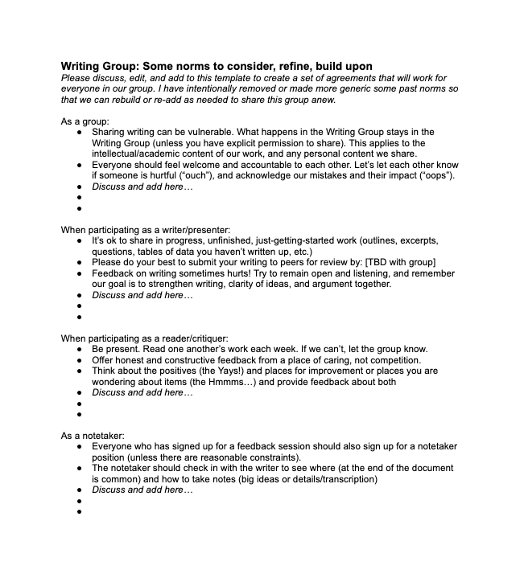
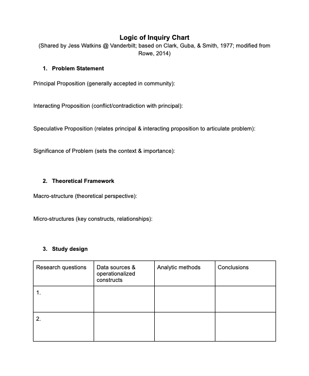
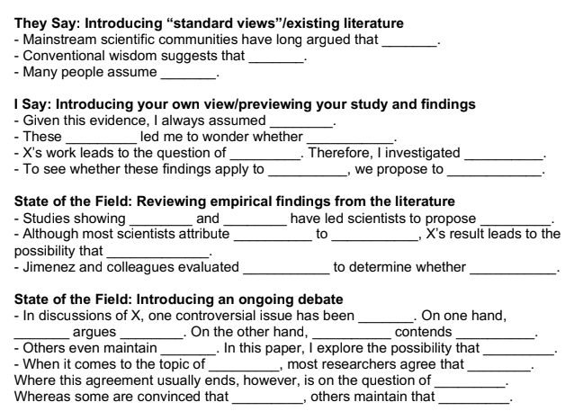

# **Welcome to** 
# EDUC 209

Academic Writing Group

Fall 2026

---

# A Warm Up...

While everyone gets settled, turn to a neighbor and reflect on these questions:

```

- How do you feel about academic writing, in general?


- What are some "rules" you've heard about academic writing?


- What might be sources of anxiety around academic writing, for you or others?

```

---

# Why I Designed this Group

When I was in graduate school, writing groups felt performative and sometimes even intimidating.

* Everyone reported how much they were writing, but no substance.

* I felt inadequate and unprepared to critique writing samples.

* I never felt like we were actually *reading* one another's writing with care or giving useful feedback.

* I was scared to share work when it was at the formative stages where feedback actually would have been most helpful.

---

# Building Relationships

Our goal here is to learn about each other, and recognize that we're here to help each other.

* It is critical to build trust and a sense of community.

* Read the work deeply, recognize the stage and nature of the work, provide the feedback that is needed *at this stage*.

* Multiple perspectives are important; so is understanding authorial intent and field/genre conventions.

#### These factors contribute to honest, generative feedback.

---

# Managing Workload

Providing detailed feedback on writing takes time. It may require multiple reads to try and understand what someone is *trying* to say, and to help them say it as clearly and powerfully as possible.

* Short, but deeply engaged samples (e.g. 5-7 pages).

* If you didn't read, just admit it.

* If you couldn't get the writing done, bring your ideas anyway.

---

# A Typical Writing Group Session

Everyone reads and leaves written comments on a shared document *before* the session.

* **10 min check-in**
    Orient to one another, vent, build trust, learn cat drama

* **40 min feedback session**
    Clarify written comments synthesize, author asks questions

* **5-10 min mini-workshop**
    Practical help with writing-related issues (abstracts, tools, etc)

---

# What is Going on?

A template to help you ensure you get the kind of feedback you need:

* Context
* Audience/Purpose/Genre
* Requirements
* Where we Should Focus

---

# Features of Good Academic Writing

Some language to help you specify what you want:

* Do I communicate clearly why this work is important?
* Is my organizational structure logical?
* Do I use references appropriately?
* Is the style appropriate for an academic journal?

---

# Some Practice Talking About Writing

This is a kind of silly activity, intentionally.

The goal is to become comfortable reflecting on our writing process and what are barriers, strategies, and new things to try. 

---

### How do you approach a new writing project?

1. You start building slowly, weaving the details together.
2. You dive right in with a frenetic brainstorm of ideas. You’ll sort out the particulars later.
3. You ask questions about the themes, reflecting on what the work says about life, identity, or human nature.
4. You’re structure-driven and incredibly methodical. There might even be a spreadsheet.
5. Every project is a brand-new adventure. You constantly experiment to keep things exciting.

---

### When you get feedback on your work, you tend to…

1. Explore how to respond without losing what makes your work unique.
2. Feel your feels. You may be overwhelmed, but it’s an opportunity to take risks and push boundaries.
3. Wonder if you’re conveying your message clearly and then helt into existential goo.
4. Go straight to the notes to see if there’s anything structural you can tighten up.
5. Use it as fuel to try something new and jump into a whole new draft.

---

### How do you feel about structure and planning?

1. Outlines are for suckers. Let thing story emerge naturally.
2. What even is a structure? You’re just trying to keep up with all your ideas!
3. You started with vagueness and you prefer to stay that way.
4. You’re all about planning; it’s what keeps your creativity grounded.
5. Every project is different! 

---

### What’s your dream feedback from a reader?

1. “Your writing is so visceral – I felt like I was inside your mind.”
2. “You brought ideas together in ways I've never thought of before.”
3. “Your approach really made me think in a new way.”
4. “This flowed beautifully and everything made sense.”
5. “Wow, I’ve never read anything like this before!”

---

# Consider...

```

Turn to a (different, if possible) partner and discuss what do you need to... 

- Build trust with new people?

- Feel comfortable sharing in progress work?

- Feel empowered to give real feedback on the work of others?

- Recieve feedback that is useful and moves you forward?

```

---

# Our Norms Doc



Based on your conversation, visit the doc at this link and consider adding or revising the proposed norms...

#### bit.ly/209fa26norms

---

# Some Resources for Writing

## Logic of Inquiry Worksheet



---

### Some Resources for Writing

## They Say/I Say



---

# Some Resources for Writing

## Strategies for Producing and Editing Text

* Hemingway App
* Write or Die
* Reverse Outlines
* Picture Frame a Day
* Written? Kitten!

---

# Sign Up to Present!

#### https://bit.ly/209FA26